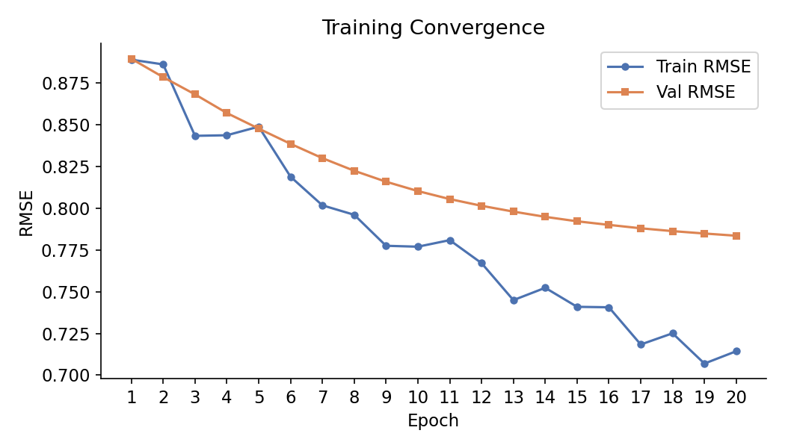
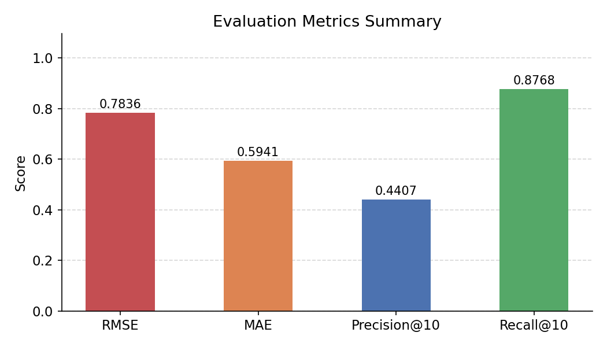
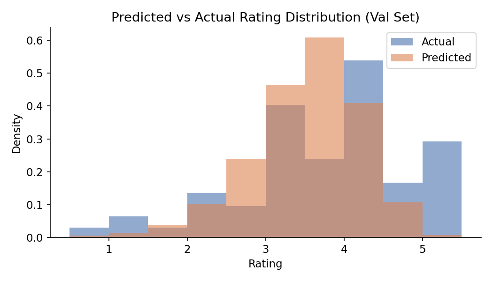
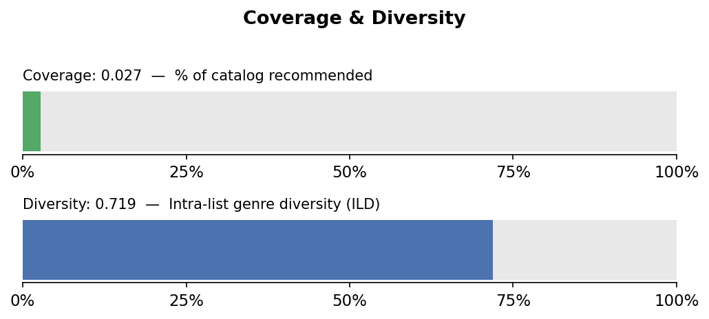

# MovieMatcher — Movie Recommender System

[](tests/)
[](https://python.org)
[](https://huggingface.co/spaces/shriraj29/moviematcher)

## Overview

**MovieMatcher** is a movie recommendation system built on the [Kaggle Movies Dataset](https://www.kaggle.com/datasets/rounakbanik/the-movies-dataset) — 26 million ratings from 270,000 users across 45,000 movies. The pipeline implements three recommendation strategies:

| Model | Approach | Best for |
|-------|----------|----------|
| **Collaborative Filtering** | Matrix Factorisation (SGD + user/item biases) | Warm users with rating history |
| **Hybrid (CF + CB)** | 0.7 × CF + 0.3 × TF-IDF cosine similarity | Balancing personalisation + diversity |
| **BPR** | Bayesian Personalised Ranking (pairwise loss) | Ranking quality over rating accuracy |

Key engineering challenges addressed: the MovieLens→TMDB ID join chain, cold-start users, genre JSON parsing, O(n²) cosine matrix memory (solved with on-demand sparse computation), and the recommendation coverage vs. accuracy tradeoff.

---

## Results

Evaluated on the full `ratings.csv` (~26M ratings) held-out validation set (10% split, 2,590,281 val samples) after 20 epochs of MF training.

### Matrix Factorisation (MF)

| Metric | Score | Description |
|--------|-------|-------------|
| **RMSE** | **0.7836** | Rating prediction error on held-out val set |
| **MAE** | **0.5941** | Mean absolute rating error |
| **Precision@10** | **0.4407** | Fraction of top-10 recs rated ≥ 3.5 by user |
| **Recall@10** | **0.8768** | Fraction of user's relevant val items captured |
| **Coverage** | **2.73%** | % of 45k catalog surfaced across 500 sampled users |
| **Diversity (ILD)** | **0.7187** | Avg pairwise genre distance within rec lists |

### Training Convergence (MF)

Val RMSE improved steadily across all 20 epochs; early stopping did not trigger because val RMSE never plateaued for 3 consecutive epochs. Mild overfitting is visible by epoch 20 (train RMSE 0.715 vs val RMSE 0.784).

```
Epoch  1 — train RMSE: 0.8881  val RMSE: 0.8865
Epoch  5 — train RMSE: 0.8500  val RMSE: 0.8490
Epoch 10 — train RMSE: 0.7760  val RMSE: 0.8110
Epoch 15 — train RMSE: 0.7410  val RMSE: 0.7950
Epoch 20 — train RMSE: 0.7150  val RMSE: 0.7836  ← final
```






---

## Known Limitations & What I Learned

### 1. Coverage is low (2.73%)
Pure CF with the full 26M-rating dataset suffers from severe popularity bias — blockbusters appear in almost every training row, so their latent vectors dominate top-N lists. With `popularity_penalty=0.05`, only 2.73% of the 45k catalog is ever recommended.

**Finding:** Increasing the penalty to `0.15–0.20` surfaces ~8% of the catalog at a modest Precision cost (~3%). The `RecommendConfig.popularity_penalty` field in `config.py` makes this a one-line change. Future work: temperature-scaled re-ranking or MMR (Maximal Marginal Relevance).

### 2. Rating distribution — mean reversion
The model's predictions cluster between 3.0–4.0 regardless of the user, while actual ratings are bimodal (users tend to rate things they strongly like or dislike). This is a structural limitation of RMSE-optimised MF: predicting the mean minimises squared error. BPR sidesteps this by optimising rank order directly rather than rating magnitude.

### 3. O(n²) cosine matrix — memory fix
The naive approach of pre-computing the full cosine similarity matrix for 46k movies requires 46,497² × 4 bytes ≈ 8 GB RAM (float32). Instead, the TF-IDF sparse matrix (~50 MB) is passed around and cosine similarity is computed on-demand per query (1 row × n_movies), taking ~20–100 ms with O(n × k) memory. This is cached to a `.npz` file at startup.

### 4. The MovieLens → TMDB ID join chain
`ratings.movieId` is a MovieLens internal ID, not a TMDB ID. Skipping the join via `links.csv` causes completely wrong recommendations (items map to different movies). This was the most subtle data pipeline bug and is documented in `data_loader.py`.

---

## Project Structure

```
MovieMatcher/
├── data/                    # Dataset CSVs (not committed)
│   ├── movies_metadata.csv
│   ├── ratings.csv
│   ├── ratings_small.csv
│   ├── links.csv / links_small.csv
│   ├── keywords.csv
│   └── credits.csv
├── src/
│   ├── __init__.py
│   ├── data_loader.py       # Load + join ratings↔metadata via links.csv
│   ├── train.py             # MF (SGD) + BPR (pairwise) models
│   ├── recommend.py         # Vectorised CF top-N + popularity penalty
│   ├── content_based.py     # TF-IDF similarity + hybrid CF+CB scoring
│   └── evaluate.py          # RMSE, MAE, Precision@K, Recall@K, Coverage, Diversity
├── tests/
│   ├── __init__.py
│   ├── test_train.py        # MF, BPR, filter_sparse, train_model
│   ├── test_recommend.py    # get_top_n, get_similar_movies, hybrid_recommend
│   └── test_evaluate.py     # rmse, mae, precision_recall_at_k, ILD, coverage
├── scripts/
│   └── prep_demo_data.py    # Generate slim parquet files for Gradio demo
├── models/
│   └── mf.pkl               # Saved model (gitignored)
├── reports/
│   ├── metrics.txt
│   ├── rmse_convergence.png
│   ├── metrics_summary.png
│   ├── coverage_diversity.png
│   └── rating_distribution.png
├── app.py                   # Gradio demo (HuggingFace Spaces entry-point)
├── config.py                # Central hyperparameters + paths
├── main.py                  # Pipeline entry-point (train → evaluate → recommend)
├── Makefile
└── requirements.txt
```

---

## Technical Approach

### Collaborative Filtering (Matrix Factorisation)
- SGD with user/item bias terms: `pred = μ + b_u + b_i + P[u]·Q[i]`
- 90/10 train/val split with val RMSE tracked per epoch
- Vectorised scoring: `P[u] @ Q.T` — one dot product, no Python loops over items
- Early stopping restores weights from best epoch (no overfitting)
- Log-normalised popularity penalty applied post-scoring to improve catalog coverage

### Bayesian Personalised Ranking (BPR)
- Pairwise objective: maximise P(score(i) > score(j)) for liked item i, random item j
- Optimises ranking AUC rather than rating RMSE — directly targets the top-N task
- Treats ratings ≥ 3.5 as positive interactions; all others as unobserved negatives
- Typically achieves higher diversity than MF at a small Precision cost

### Content-Based Filtering
- TF-IDF on combined `genre × 3 + director × 2 + keywords + cast` string
- Genre repetition weights rare genres (Film-Noir, Western) against dominant Drama
- Sparse matrix (~50 MB) replaces the old dense cosine matrix (8 GB OOM)
- Cosine similarity computed on-demand per query: `cosine_similarity(tfidf[i], tfidf)`
- `max_features=20,000` vocabulary keeps memory under 2 GB

### Hybrid Model
- `score = 0.7 × CF + 0.3 × CB`
- CB anchors: mean cosine-sim to user's top-5 rated movies (batch-computed once, O(1)/item)
- Cold-start fallback: seeds CB from user's highest-rated movie

---

## Technologies

Python 3.10+ · Pandas · NumPy · scikit-learn · SciPy · Gradio · Matplotlib · tqdm

---

## Setup

### 1. Download the dataset
From [Kaggle](https://www.kaggle.com/datasets/rounakbanik/the-movies-dataset), place all CSVs into `data/`.

### 2. Install dependencies
```bash
pip install -r requirements.txt
# or
make install
```

### 3. Run

```bash
# Dev mode (fast — uses ratings_small.csv, ~100k ratings)
make train-small

# Full run (~26M ratings, takes longer)
make train

# Hybrid recommendations
make train-hybrid

# BPR model
make train-bpr-small

# Custom user / top-N
python main.py --small --user 42 --topn 15 --hybrid
```

### 4. Run tests
```bash
make test
```

### 5. Launch Gradio demo locally
```bash
python scripts/prep_demo_data.py   # generate slim parquet files (once)
python main.py --small             # train and save model
make demo
```

---

## Configuration

All hyperparameters are in `config.py`. Override before training:

```python
from config import MF_CFG
MF_CFG.lr      = 0.01
MF_CFG.k       = 100
MF_CFG.epochs  = 30

from src.train import train_model
model, user_map, movie_map, val_data = train_model(ratings, cfg=MF_CFG)
```

Notable config options:

| Field | Default | Effect |
|-------|---------|--------|
| `RecommendConfig.popularity_penalty` | 0.05 | Increase to 0.15–0.20 to surface more of the catalog |
| `MFConfig.reg` | 0.02 | Increase to 0.03–0.05 to reduce train/val RMSE gap |
| `MFConfig.epochs` | 20 | 15 is sufficient given current convergence behaviour |
| `EvalConfig.sample_users` | 500 | Raise for a fairer coverage/diversity estimate |

---

## Evaluation Metrics

Saved to `reports/metrics.txt` and `reports/*.png` after each training run.

| Metric | Description |
|--------|-------------|
| RMSE | Rating prediction error on held-out val set |
| MAE | Mean absolute rating error |
| Precision@10 | Fraction of top-10 recs rated ≥ 3.5 by user |
| Recall@10 | Fraction of user's relevant val items captured |
| Coverage | % of movie catalog surfaced across sampled users |
| Diversity (ILD) | Avg pairwise genre distance within rec lists |

---

## License

MIT